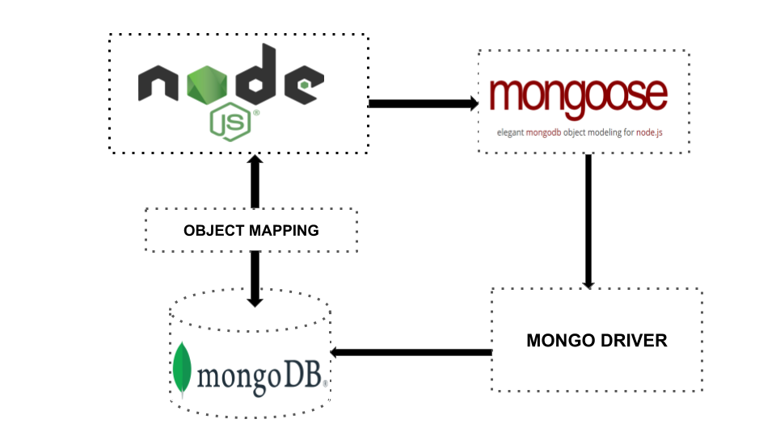

## What is `Express` ?

### - is a nodejs framework that that helps manage servers and routes

## `Mongoose`

### - is Object Data Modeling library for MongoDB

### - it allows to enforce a specific schema

### - it manages relationships between data

### - it is used to translate between objects in code and the representation of those object ins MongoDB

